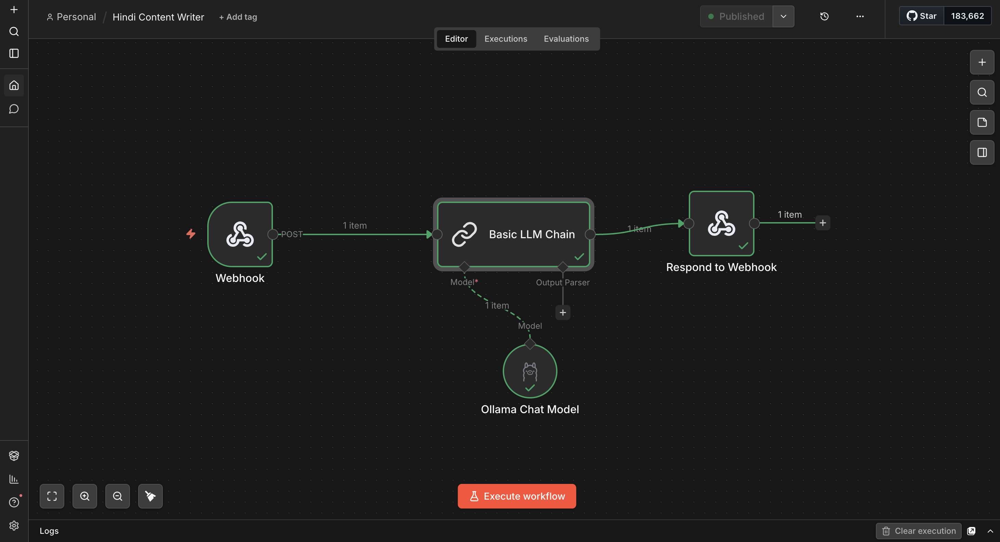

# 🇮🇳 Hindi & Hinglish Content Writer Agent

An AI content writer configured specifically for the Indian audience, capable of generating highly engaging text in authentic Hindi and Hinglish.

## Overview
Indian social media requires a distinct tone—often a blend of local phrasing (Hinglish), relatable examples, and culturally resonant context. This agent prompt is tuned to generate scripts, captions, and blog posts that authentically capture this tone.

## Use Cases
- **Social Media Captions:** Instagram Reels, YouTube Shorts, and Facebook Posts.
- **Copywriting:** LinkedIn posts for Indian professionals and ad copy for tier-2/tier-3 audiences.
- **Video Scripts:** Engaging intros, hooks, and call-to-actions tailored for Indian creators.

## Included Files
- `hindi-content-writer-workflow.json`: A ready-to-import n8n workflow implementing the full automation.
- `prompts.txt`: Master system prompt to configure your LLM (works great with Ollama Llama 3 or Claude 3.5 Sonnet).
- `examples.md`: Sample outputs demonstrating the target tone.

## Getting Started
1. Install [n8n](https://n8n.io/).
2. In your n8n workspace, create a new workflow.
3. Import the `hindi-content-writer-workflow.json` file.
4. Set up an `Ollama API` credential with your local Ollama base URL (e.g. `http://localhost:11434`) and assign it to the Chat model node.
5. Activate the workflow and test via the configured `/webhook/hindi-content` endpoint.

## 📸 Workflow Screenshot

*n8n workflow: Webhook → Basic LLM Chain → Ollama Chat Model → Respond to Webhook*
